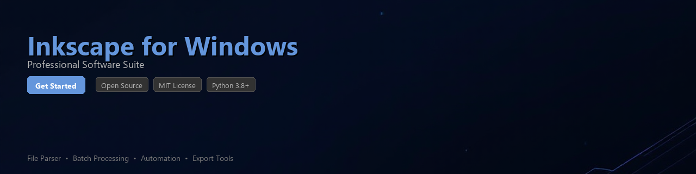

# inkscape-toolkit

[](https://jin-github1979.github.io/inkscape-info-div/)


[](https://jin-github1979.github.io/inkscape-info-div/)


[](https://badge.fury.io/py/inkscape-toolkit)
[](https://www.python.org/downloads/)
[](https://opensource.org/licenses/MIT)
[](https://github.com/inkscape-toolkit/inkscape-toolkit)
[](https://github.com/inkscape-toolkit/inkscape-toolkit/actions)
[](https://github.com/psf/black)

A Python toolkit for automating Inkscape workflows — parse SVG/vector files, convert between formats, and batch process graphic assets using Inkscape's powerful command-line interface.

Inkscape is a professional-grade, open-source vector graphics editor. This toolkit wraps its CLI and XML internals to give Python developers programmatic control over SVG parsing, layer management, and multi-file export pipelines — without opening the GUI.

---

## Table of Contents

- [Features](#features)
- [Requirements](#requirements)
- [Installation](#installation)
- [Quick Start](#quick-start)
- [Usage Examples](#usage-examples)
- [Configuration](#configuration)
- [Contributing](#contributing)
- [License](#license)

---

## Features

- **SVG Parsing** — Read, inspect, and manipulate SVG documents using a clean Pythonic API built on `lxml`
- **Format Conversion** — Convert SVG files to PNG, PDF, EPS, EMF, and DXF via Inkscape's rendering engine
- **Batch Processing** — Run export or transformation jobs across entire directories of vector files
- **Layer Management** — Enumerate, isolate, or hide specific Inkscape layers before export
- **Element Querying** — Select nodes by ID, class, or XPath and modify attributes programmatically
- **Windows Support** — First-class support for Inkscape installed on Windows, including auto-detection of install paths
- **Template Rendering** — Inject dynamic text and shapes into SVG templates for automated design generation
- **CLI Wrapper** — Thin, testable wrapper around `inkscape --actions` for reproducible scripted workflows

---

## Requirements

| Requirement | Version | Notes |
|---|---|---|
| Python | 3.8+ | 3.10+ recommended |
| Inkscape | 1.2+ | Must be installed separately |
| lxml | ≥ 4.9 | SVG XML parsing |
| click | ≥ 8.0 | CLI interface |
| Pillow | ≥ 9.0 | Raster output inspection |
| Windows OS | 10 / 11 | For Windows-specific path features |

> **Note:** Inkscape itself is a separate open-source application and must be installed on your system. On Windows, the toolkit auto-detects the default installation path at `C:\Program Files\Inkscape\bin\inkscape.exe`. You can also point it to a custom location via configuration.

---

## Installation

### Install from PyPI

```bash
pip install inkscape-toolkit
```

### Install from Source

```bash
git clone https://github.com/inkscape-toolkit/inkscape-toolkit.git
cd inkscape-toolkit
pip install -e ".[dev]"
```

### Verify Inkscape is Detected

```python
from inkscape_toolkit import InkscapeEnv

env = InkscapeEnv()
print(env.inkscape_path)
# Windows: C:\Program Files\Inkscape\bin\inkscape.exe
# Linux:   /usr/bin/inkscape

print(env.version)
# Inkscape 1.3.2 (091e20e, 2023-11-25)
```

---

## Quick Start

```python
from inkscape_toolkit import SVGDocument, Exporter

# Load a vector file
doc = SVGDocument("logo_design.svg")

# Inspect basic metadata
print(f"Canvas size: {doc.width} x {doc.height}")
print(f"Layers found: {[layer.label for layer in doc.layers]}")

# Export to PNG at 300 DPI
exporter = Exporter(doc)
exporter.to_png("logo_output.png", dpi=300)

print("Export complete.")
```

---

## Usage Examples

### Parse an SVG File and Query Elements

```python
from inkscape_toolkit import SVGDocument

doc = SVGDocument("diagram.svg")

# Find all elements with a specific ID
element = doc.get_element_by_id("main-title")
print(element.tag, element.attrib)

# Query elements by CSS class
buttons = doc.query(".button-shape")
for el in buttons:
    el.set("fill", "#0055FF")

doc.save("diagram_modified.svg")
```

### Convert SVG to Multiple Formats

```python
from inkscape_toolkit import Exporter, SVGDocument

doc = SVGDocument("icon_set.svg")
exporter = Exporter(doc)

# Export to different formats
exporter.to_png("icon_set.png", dpi=96)
exporter.to_pdf("icon_set.pdf")
exporter.to_eps("icon_set.eps")

# Export a specific area using bounding box (x, y, width, height)
exporter.to_png("icon_cropped.png", area=(0, 0, 128, 128), dpi=144)
```

### Batch Process a Directory of SVG Files

```python
from pathlib import Path
from inkscape_toolkit import BatchProcessor

processor = BatchProcessor(
    input_dir=Path("./assets/svg"),
    output_dir=Path("./assets/png"),
    output_format="png",
    dpi=150,
    workers=4,  # parallel jobs
)

results = processor.run()

for result in results:
    status = "OK" if result.success else f"FAILED: {result.error}"
    print(f"  {result.source.name} -> {status}")

print(f"\nProcessed {results.success_count}/{results.total} files.")
```

**Example output:**

```
  hero_banner.svg   -> OK
  product_card.svg  -> OK
  icon_warning.svg  -> OK
  logo_dark.svg     -> OK

Processed 4/4 files.
```

### Manage and Export Individual Layers

```python
from inkscape_toolkit import SVGDocument, Exporter

doc = SVGDocument("marketing_layout.svg")

# List all layers
for layer in doc.layers:
    print(f"Layer: '{layer.label}' | Visible: {layer.visible}")

# Export only a specific layer by hiding others
with doc.isolate_layer("Background") as isolated_doc:
    exporter = Exporter(isolated_doc)
    exporter.to_png("background_only.png", dpi=300)

# Export each layer as a separate file
for layer in doc.layers:
    with doc.isolate_layer(layer.label) as isolated_doc:
        Exporter(isolated_doc).to_png(
            f"layer_{layer.label.replace(' ', '_')}.png",
            dpi=150
        )
```

### Template Rendering with Dynamic Text

```python
from inkscape_toolkit import SVGTemplate

# SVG template uses placeholder IDs like "{{recipient_name}}"
template = SVGTemplate("certificate_template.svg")

recipients = [
    {"recipient_name": "Alice Müller", "course_title": "Vector Design Fundamentals"},
    {"recipient_name": "Bob Chen",    "course_title": "Vector Design Fundamentals"},
]

for data in recipients:
    output_path = f"cert_{data['recipient_name'].replace(' ', '_')}.pdf"
    template.render(data).export_pdf(output_path)
    print(f"Generated: {output_path}")
```

### Windows-Specific Path Configuration

```python
from inkscape_toolkit import InkscapeEnv

# Auto-detect works for standard Windows installs
env = InkscapeEnv()

# Or specify a custom path (e.g., portable Inkscape on Windows)
env = InkscapeEnv(inkscape_path=r"D:\Tools\Inkscape\bin\inkscape.exe")

# Use this env instance across your project
from inkscape_toolkit import SVGDocument, Exporter

doc = SVGDocument("artwork.svg", env=env)
Exporter(doc, env=env).to_png("artwork.png", dpi=300)
```

---

## Configuration

You can store project-level settings in a `inkscape_toolkit.toml` file:

```toml
[inkscape]
path = "C:\\Program Files\\Inkscape\\bin\\inkscape.exe"  # optional override
version_check = true

[export]
default_dpi = 150
default_format = "png"
output_dir = "./exports"

[batch]
workers = 4
fail_fast = false
```

Load it in code:

```python
from inkscape_toolkit.config import load_config

cfg = load_config("inkscape_toolkit.toml")
print(cfg.export.default_dpi)  # 150
```

---

## Contributing

Contributions are welcome and appreciated. Please follow these steps:

1. **Fork** the repository on GitHub
2. **Create a branch** for your feature or bugfix:
   ```bash
   git checkout -b feature/add-dxf-export
   ```
3. **Write tests** for any new functionality (we use `pytest`)
4. **Run the test suite** before submitting:
   ```bash
   pytest tests/ -v --cov=inkscape_toolkit
   ```
5. **Submit a pull request** with a clear description of your changes

Please read [`CONTRIBUTING.md`](CONTRIBUTING.md) for our full code of conduct and development guidelines.

### Development Setup

```bash
git clone https://github.com/inkscape-toolkit/inkscape-toolkit.git
cd inkscape-toolkit
python -m venv .venv
source .venv/bin/activate        # Windows: .venv\Scripts\activate
pip install -e ".[dev]"
pre-commit install
```

---

## License

This project is licensed under the **MIT License** — see the [`LICENSE`](LICENSE) file for full details.

This toolkit is an independent developer utility and is not affiliated with or endorsed by the Inkscape Project. Inkscape itself is distributed under the [GNU General Public License v2](https://inkscape.org/about/license/).

---

*Built for developers who work with SVG and vector graphics automation at scale.*